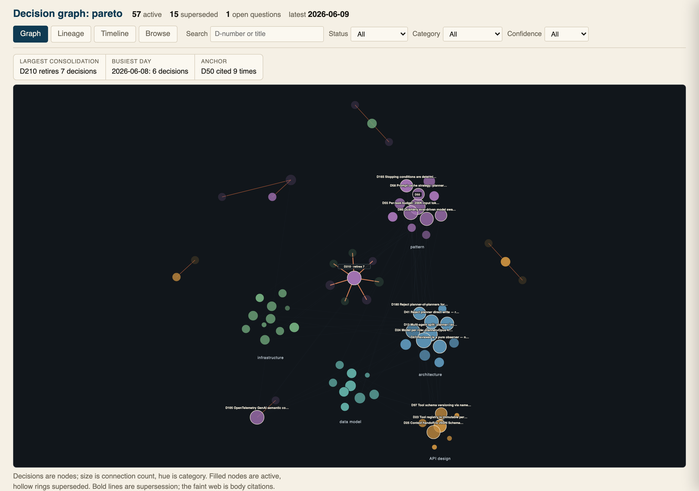

# Nauro

Nauro is a decision system for agentic engineering. It keeps your project's decisions, rationale, and rejected paths in plain markdown files, then surfaces the relevant ones before an AI agent plans or changes code.

It works across Claude, Cursor, Codex, Perplexity, and any MCP client. The result is persistent project judgment that travels with the work, not with a single tool or session.

[](https://pypi.org/project/nauro/) [](https://pypi.org/project/nauro/) [](LICENSE)

https://github.com/user-attachments/assets/9e6c475b-c584-470b-84c2-12f01b3a425a

*A coding agent checks the project's prior decisions before it plans, then records the approved decision and makes the change. Captured in Codex.*

**Status:** Stable (1.x). The nauro CLI, the stdio MCP tool contract, and the on-disk store format follow semantic versioning. Cloud sync is versioned and operated separately.

More at [nauro.ai](https://nauro.ai).

## How it works

Nauro stores your project's decisions as plain markdown files, each with the alternatives you ruled out and the reasoning behind them. When an agent proposes an approach, `check_decision` runs deterministic keyword retrieval (BM25) over those files and surfaces the related ones before the agent plans or writes code.

No model judges your decisions. The check is advisory and never blocks a change. A decision is recorded only by an explicit write call, and the approval gate lives in the conversation. The store is a folder you own; remove Nauro and the markdown stays.

## Install

```bash
uv tool install nauro     # uv fetches its own Python — nothing else needed
```

No `uv`? Install it with `curl -LsSf https://astral.sh/uv/install.sh | sh` (macOS/Linux) or the [PowerShell line](https://docs.astral.sh/uv/getting-started/installation/) on Windows. Already on Python 3.10+? `pipx install nauro` (or `pip install nauro`) works too.

First run asks once about anonymous telemetry, defaulting to no; nothing is sent unless you opt in. `nauro telemetry status` shows the current setting, and `NAURO_TELEMETRY=0` disables both the telemetry and the prompt.

## Quickstart

No account, no MCP wiring, no restart:

```bash
mkdir -p /tmp/nauro-demo && cd /tmp/nauro-demo
nauro init --demo
nauro check-decision "Add a WebSocket endpoint for live task updates"
```

The demo store holds thirteen example decisions. One of them ruled out WebSocket in favor of SSE, and `check-decision` surfaces it as the top match before your agent can re-propose it:

```json
{
  "store": "local",
  "related_decisions": [
    {
      "id": "decision-004",
      "title": "SSE over WebSocket for live updates",
      "score": 6.635,
      "status": "active",
      "date": "2026-03-15",
      "rationale_preview": "Server-Sent Events (SSE) for pushing live task updates to the frontend. SSE uses standard HTTP, reconnects automatically on disconnect, and works through every proxy and load balancer..."
    }
  ],
  "assessment": "Found 5 related decisions. Top match: D004 \"SSE over WebSocket for live updates\" (status active, decided 2026-03-15, BM25 6.6). Ranked by keyword overlap, not meaning — judge relevance from the decision body, not the rank. Call get_decision on each related decision before proposing.",
  "project": { "id": "01K...", "name": "demo-project" }
}
```

Output abbreviated to the top match; the live call returns all five related decisions, ranked by score. The same result reaches your agent through the MCP `check_decision` tool, so it sees the prior decision in the flow rather than after the fact.

`nauro graph` renders the decision history to one self-contained HTML file and opens it. The file has four views: Graph (a node-link map of the whole store on a deterministic layout, the default), Lineage (one drawn supersession DAG per thread, with consolidations as the prominent fan-ins), Timeline (decisions on a true date axis), and Browse (every decision grouped by category, with superseded ones dimmed). By default the file embeds the full decision store — titles, metadata, open-question summaries, and each decision's full body, rendered as structured detail in the side panel so the rationale reads at a glance — so it lands in the store directory rather than the repo; pass `--output` to write it elsewhere. Pass `--no-include-bodies` for a redacted artifact (titles and metadata only) that is safer to share more widely.

<picture><source media="(prefers-color-scheme: dark)" srcset="docs/images/graph-dark.png"></picture>

*A project store rendered by nauro graph: supersession threads converge on the decisions that replaced them, and standalone decisions cluster by category.*

## Why not ADRs, grep, CLAUDE.md, or a memory product?

A decision log in your repo is a good record. The gap is on the read side: a file is read when a person opens it, and a fresh agent session starts with no knowledge that it exists. Nauro closes that gap twice over: the relevant decision reaches your agent through MCP at the moment it proposes a change, and `nauro sync` regenerates a committable `AGENTS.md` summary in every associated repo, so clones and tools without MCP wiring still start from the current record.

Against a coding tool's built-in memory (Claude Code memory, Cursor memories): those are scoped to one tool and one user. Nauro's record belongs to the project. The same store answers in Claude, Cursor, Codex, and any MCP client, across every repo you associate with it.

Against agent-memory products: most extract and store memories from conversations automatically. Nauro records decisions instead: an entry is a reviewed choice with its rationale and the alternatives you rejected, written only on an explicit call after approval in the conversation, retrieved by deterministic keyword search you can audit, and superseded rather than silently rewritten. It is plain markdown in a folder you own; remove Nauro and the record stays readable.

## When Nauro helps, and when it doesn't

Nauro pays off when an agent needs project judgment before acting: architecture choices, rejected approaches, migration plans, operational constraints, and decisions that recur across sessions or tools.

The limits are worth knowing. It surfaces only what has been recorded as a decision. It adds an MCP round-trip to the agent's flow. Retrieval is keyword-based, which is fast, offline, and auditable, and can miss a decision phrased in different words than the proposal; an optional embeddings index is available for closer synonym matching.

## Adopt Nauro in your project

**New project:**

```bash
nauro init my-project
nauro setup claude-code   # or: nauro setup all
```

`nauro init` writes `.nauro/config.json` into the repo; commit it. For cloud sync from the start, run `nauro auth login` first, then `nauro init --cloud my-project`.

**One project across several repos:** the store lives outside any repo, so multiple repos can share it. Associate another repo with an existing project from inside that repo:

```bash
cd ../my-other-repo
nauro init my-project --add-repo .
```

Re-running plain `nauro init my-project` in a second repo creates a *separate* project that shares no decisions — use `--add-repo` to link them instead.

**Existing repo with docs to seed from:**

```bash
nauro adopt
```

`nauro adopt` registers the project, wires MCP across Claude Code, Cursor, and Codex, and installs a `/nauro-adopt` skill. Restart your agent and invoke `/nauro-adopt`.

Add `--with-subagents` on `nauro adopt` or `nauro setup` to install Nauro's bundled Claude Code subagents into `~/.claude/agents/`. The typical workflow:

- `@nauro-planner` before non-trivial work. Drafts a plan and classifies doctrine risk (GREEN/AMBER/RED) against your decision log.
- `@nauro-executor` after a plan is agreed. Implements it, runs tests, opens a PR.
- `@nauro-reviewer` before merging. Audits the diff for real bugs and for missing decision references.
- `@nauro-tech-lead` to set or correct direction. Reads the decision log, audits PRs against doctrine, files decisions when direction is established.

Chat surfaces (Claude.ai, Perplexity): run `nauro adopt` from a terminal first, then point the chat agent at [`docs/adopt-prompt.md`](docs/adopt-prompt.md).

**Already keeping ADRs or a Memory Bank:**

```bash
nauro import --adr docs/adr          # NNN-title.md decision records
nauro import --memory-bank .context  # Cline / Roo Code Memory Bank
```

`nauro import` migrates the existing records into the current repo's project store (run `nauro init` or `nauro adopt` first) and captures a snapshot. Memory-Bank `decisionLog.md` entries need `## Decision: <title>` headings to import.

## Cross-surface sync (optional)

The steps above work fully on your machine with no account. To sync a project to the cloud and reach it from surfaces without a local copy (claude.ai web) or from another machine:

```bash
nauro auth login
nauro link --cloud   # one-time: promote the local project to cloud
nauro sync
```

Then add `https://mcp.nauro.ai/mcp` as an MCP connector in your tool's settings.

### Codex (remote connector)

Add it under a name distinct from the local `nauro` stdio server:

```bash
codex mcp add nauro-cloud --url https://mcp.nauro.ai/mcp
```

Then pin the OAuth callback port at the top of `~/.codex/config.toml`. Codex's callback uses a fixed, pre-registered port; without it Codex picks a random port and login fails:

```toml
mcp_oauth_callback_port = 8765
```

Requires Codex 0.131.0 or newer. Enter the URL exactly as shown, with no trailing slash. If login reports a callback-port error, free port 8765.

## MCP tools

11 tools total (8 read, 3 write). The local stdio server registers 10 (7 read, 3 write); `list_projects` is remote-only.

**Read:** `check_decision`, `get_context`, `list_decisions`, `get_decision`, `search_decisions`, `get_raw_file`, `diff_since_last_session`, `list_projects` *(remote-only)*.

**Write:** `propose_decision`, `flag_question`, `update_state`.

`nauro check-decision "<approach>"` runs `check_decision` from the shell. The write tools surface the same way:

```bash
nauro propose-decision "In-memory cache for hot read paths" --title "Adopt Redis" \
    --files-affected src/cache.py --files-affected src/api.py \
    --rejected '[{"alternative": "Memcached", "reason": "Less feature-rich"}]'
```

Repeat `--files-affected` for each entry. `--rejected` accepts inline JSON, `@file.json`, or `-` to read from stdin.

## Uninstall

```bash
nauro adopt --remove   # from the repo root
```

`adopt --remove` is the inverse of `nauro adopt` for that repo: it removes the MCP, skill, subagent, and hook wiring across surfaces, strips the generated `AGENTS.md` (a hand-written `# Manual` section is preserved), deletes `.nauro/config.json`, and deregisters the repo, after one confirmation prompt (`--yes` skips it). When a project spans several repos, only the current repo is dropped and shared artifacts stay for the siblings.

The decision store is never deleted by default; it stays on disk as plain markdown. Pass `--purge-store` to delete it too, allowed only on the project's last repo. `nauro setup <surface> --remove` un-wires a single surface instead, and `uv tool uninstall nauro` (or `pipx uninstall nauro`) removes the CLI itself.

## Packages

| Package | Path | Install |
|---|---|---|
| `nauro` | `packages/nauro/` | `uv tool install nauro` |
| `nauro-core` | `packages/nauro-core/` | `pip install nauro-core` |

`nauro-core` is the parsing, validation, and context assembly shared between the CLI and the hosted MCP server. Minimal dependencies; usable by third-party tools that read or write the Nauro decision format.

The hosted MCP server (`mcp.nauro.ai`) lives in a private repository.

## Development

See [CLAUDE.md](CLAUDE.md) for architecture. Bugs and feature requests: [GitHub Issues](https://github.com/Nauro-AI/nauro/issues).

```bash
uv sync --all-packages --all-extras
uv run pytest packages/nauro-core/tests/ -x -q
uv run pytest packages/nauro/tests/ -x -q
```

---

Apache 2.0.

Named for Peter Naur, whose 1985 paper *Programming as Theory Building* argued the real program is the theory in the programmer's mind, not the code. Every fresh agent session is the equivalent of losing that programmer.
